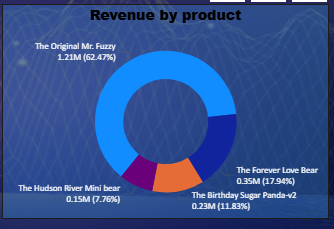

# 🛒 BearCart: E-Commerce Growth & Conversion Intelligence

## 📌 Project Overview
BearCart is a growing e-commerce platform that experienced strong traffic growth but struggled with declining conversion efficiency and revenue concentration.

This project analyzes user behavior, funnel performance, marketing channel quality, and revenue drivers to identify actionable business improvements using data-driven insights.

## 🎯 Business Questions Addressed
- Why is high website traffic not translating into proportional revenue?
- Where is the biggest drop-off occurring in the conversion funnel?
- Which marketing channels bring high-intent vs low-intent users?
- How dependent is revenue on a limited set of products?
- Which products contribute most to refund-related revenue loss?
- How does device usage impact user behavior and conversions?

## 📊 Key KPIs Tracked
### Total Revenue
Overall business performance

### Revenue per Session
Traffic monetization efficiency

### Average Order Value (AOV)
Customer spending behavior

### Session-to-Order Conversion Rate
Funnel effectiveness

### Cart-to-Order Conversion Rate
Checkout performance

### Refund Rate (Revenue-Based)
Revenue leakage indicator

## 🧩 Dashboard Overview

This dashboard is designed to provide a business-first view of e-commerce performance, focusing on revenue efficiency, conversion bottlenecks, user behavior, and risk areas such as refunds and channel quality.

---

### 🖼️ KPI, Revenue & Traffic Performance
- Tracks overall revenue, revenue per session, and average order value (AOV)
- Analyzes monthly order trends and year-wise traffic growth  
**Key Insight:** Revenue is heavily concentrated among a small set of products, while traffic growth peaked earlier and later declined, indicating a shift from growth to efficiency challenges.

---

### 🖼️ Conversion Funnel Analysis
- Breaks down the user journey from homepage sessions to cart and completed orders  
**Key Insight:** The largest drop-off occurs at the cart-to-checkout stage, highlighting checkout friction as the primary conversion bottleneck rather than traffic acquisition.

---

### 🖼️ Product Revenue & Refund Risk
- Compares product-level revenue contribution
- Evaluates revenue-based refund rates across products  
**Key Insight:** Certain products generate significant revenue but also contribute disproportionately to refund-related revenue loss, creating hidden profitability risk.

 

---

### 🖼️ Channel & Device Performance
- Compares traffic share vs revenue share across marketing channels
- Analyzes desktop vs mobile usage behavior  
**Key Insight:** Search channels attract high-intent users with strong revenue contribution, while social channels underperform. Desktop dominates usage, suggesting untapped potential and possible friction in the mobile experience.

 

## 💡 Key Business Insights & Decisions

### 🔹 Optimize Checkout Experience
**Insight:** Only ~23.5% of cart sessions convert into completed orders.  
**Decision:** Simplify checkout flow, improve load times, and surface pricing & return policies earlier.

### 🔹 Reallocate Marketing Spend
**Insight:** Search channels outperform social channels in conversion efficiency.  
**Decision:** Prioritize high-intent channels to improve ROI.

### 🔹 Reduce Revenue Dependency Risk
**Insight:** Revenue is concentrated among a few products.  
**Decision:** Promote secondary products and introduce bundles.

### 🔹 Address High Refund Products
**Insight:** High refund-related revenue losses from specific products.  
**Decision:** Improve product quality and expectation alignment.

### 🔹 Improve Mobile Experience
**Insight:** Mobile traffic underperforms.  
**Decision:** Optimize mobile UI and checkout flow.

## ⚠️ Limitations
- Analysis is based on historical data only  
- No user-level cohort or retention analysis
- No predictive modeling implemented yet

## 📂 Power BI Dashboard Access
Due to file size limitations on GitHub, the complete interactive Power BI dashboard file is not hosted directly in this repository.

The dashboard can be shared upon request or during interviews.

